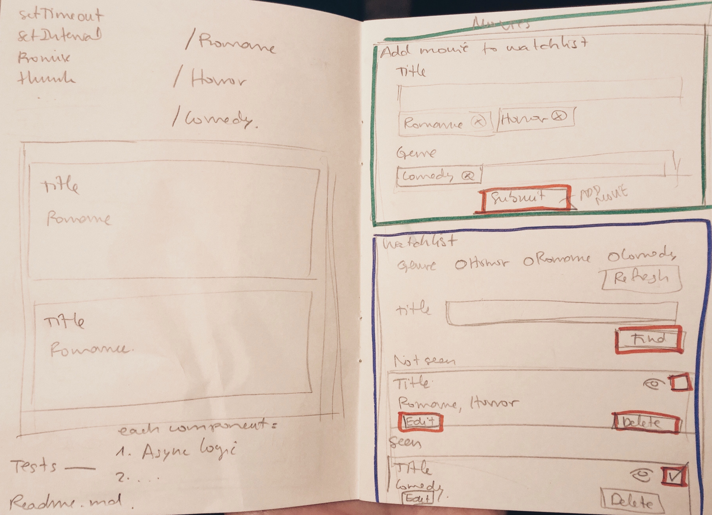

## 🍿🎬 Movies Watchlist App 🎬🍿

React movies watchlist app

##### What it seemed like  

##### What it looks like 

##### ✅ Done 
- Redux and Hooks to manage the state
- Add movies by title
- Sort movies. Watched/Checked movies move down to the bottom.
- Responsive design, mobile first with some UX
- CSS without any framework, just CSS Flexible Box Layout

##### ❌ To Do
- Add at least one test for each component
- Find movies by title or genre
- Async logic with thunk
- Routes (romance, horror and comedy)
- Add a setTimeout or setInterval loading with a delay of 3 seconds

##### Available Scripts

In the project directory, you can run:

##### `npm start`

Runs the app in the development mode. 
Open [http://localhost:3000](http://localhost:3000) to view it in the browser.

The page will reload if you make edits. 
You will also see any lint errors in the console.

##### Paula Romero Armas 